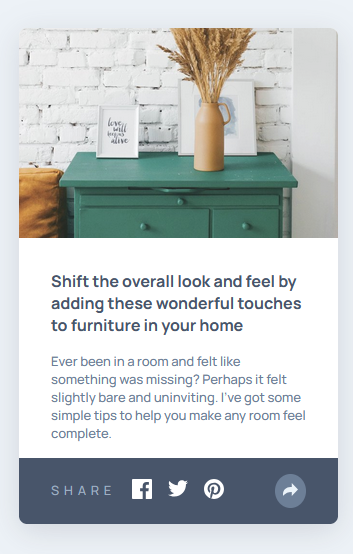

# Frontend Mentor - Article preview component solution

This is a solution to the [Article preview component challenge on Frontend Mentor](https://www.frontendmentor.io/challenges/article-preview-component-dYBN_pYFT). Frontend Mentor challenges help you improve your coding skills by building realistic projects. 

## Table of contents

- [Overview](#overview)
  - [The challenge](#the-challenge)
  - [Screenshot](#screenshot)
  - [Links](#links)
- [My process](#my-process)
  - [Built with](#built-with)
  - [Continued development](#continued-development)
  - [Useful resources](#useful-resources)
- [Author](#author)
- [Acknowledgments](#acknowledgments)

## Overview

### The challenge

Users should be able to:

- View the optimal layout for the component depending on their device's screen size
- See the social media share links when they click the share icon

Additions:

- Added animations to share button links and arrow button

### Screenshot

Desktop Modes:

Mobile Modes:

### Links

- Solution URL: (https://github.com/CHarvey820/article-preview-component-master)
- Live Site URL: (https://charvey820.github.io/article-preview-component-master)

## My process

### Built with

- Semantic HTML5 markup
- CSS custom properties
- Flexbox
- Mobile-first workflow

### Continued development

The positioning of the socials popup isn't the most fluid on desktop sizes, some overall refactoring would be required.

### Useful resources

- [CSS Filter Generator](https://codepen.io/sosuke/pen/Pjoqqp) - Applies a filter to svgs to change their visible color

## Author

- GitHub - [CHarvey820](https://github.com/CHarvey820)
- Frontend Mentor - [CHarvey820](https://www.frontendmentor.io/profile/CHarvey820)

